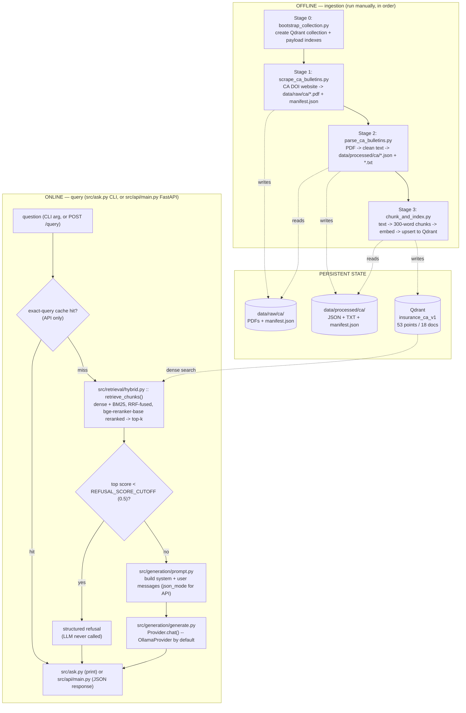
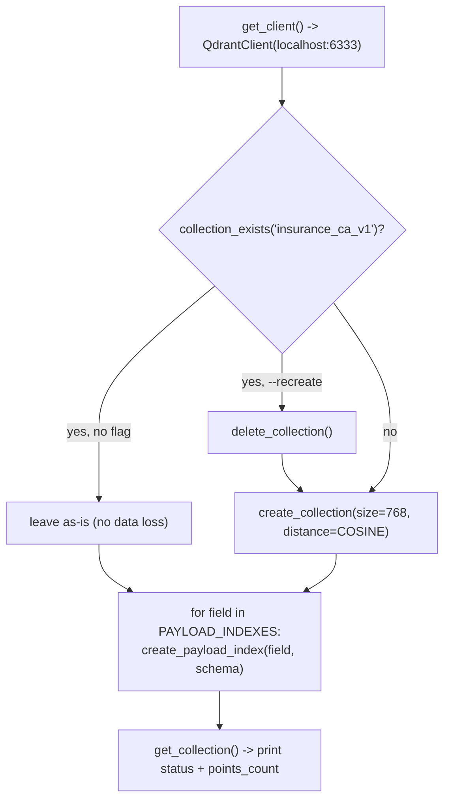
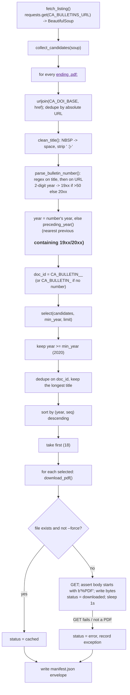
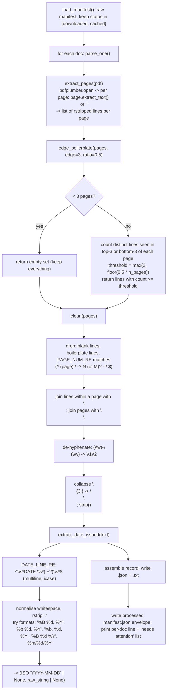
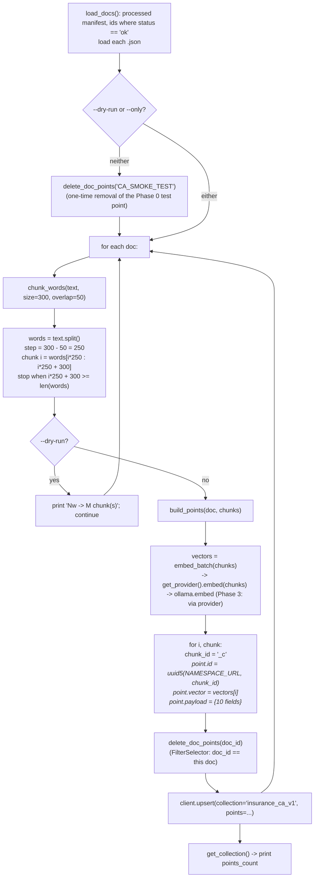

# Current Pipeline — State Insurance Regulations Knowledge Assistant

**Status:** end of Phase 4 (UI, citations & feedback, California only). The
offline ingestion pipeline (§3–6) is unchanged since Phase 2. The online
query pipeline (§7) reflects Phase 3: production retrieval is
`src/retrieval/hybrid.py::retrieve_chunks()` (BM25+dense fused via RRF,
reranked by `bge-reranker-base`, now with an optional `document_type`
filter — Phase 4), shared by `src/ask.py` (CLI), `src/api/main.py` (FastAPI
service, §7.5), and now `ui/app.py` (Streamlit, §11, calling the API over
HTTP — never the pipeline directly). A score-threshold refusal guardrail
(`REFUSAL_SCORE_CUTOFF=0.5`) skips the LLM call entirely on out-of-scope
questions, `src/providers/` abstracts the LLM/embedding backend, and Phase 4
adds durable feedback storage (`feedback.db`, SQLite) plus two admin-facing
API endpoints.

See `data/eval/results.md` / `hybrid_rerank_scores.json` for the retrieval
numbers, and `docs/scaling-notes.md` for what changes at production scale
(in-memory cache, process-lifetime singletons, etc.).

This document describes **exactly what the code does today**, module by module.
It is a snapshot; when a phase changes the flow, update this file.

---

## 1. The two pipelines

The system has an **offline ingestion pipeline** (run by hand, populates the
vector store) and an **online query pipeline** (runs per question).



---

## 2. Configuration reference (`config/settings.py`)

Every module imports its constants from here. Env vars of the same name override.

| Constant | Value | Used by |
|---|---|---|
| `PROJECT_ROOT` | repo root (`Path(__file__).parents[1]`) | all path constants |
| `DATA_DIR` | `<root>/data` | — |
| `RAW_CA_DIR` | `<root>/data/raw/ca` | scrape (write), parse (read) |
| `PROCESSED_CA_DIR` | `<root>/data/processed/ca` | parse (write), chunk (read) |
| `EVAL_DIR` | `<root>/data/eval` | Phase 2 (unused now) |
| `CA_DOI_BASE` | `https://www.insurance.ca.gov` | scrape (URL resolution) |
| `CA_BULLETINS_URL` | `.../bulletin-notices-commiss-opinion/bulletins.cfm` | scrape (listing), parse/chunk (manifest provenance) |
| `HTTP_HEADERS` | `{"User-Agent": "insurance-rag-bot/0.1 (educational RAG project)"}` | scrape |
| `REQUEST_DELAY_SEC` | `1.0` | scrape (delay between downloads) |
| `CHUNK_SIZE_WORDS` | `300` | chunk |
| `CHUNK_OVERLAP_WORDS` | `50` | chunk |
| `QDRANT_HOST` / `QDRANT_PORT` | `localhost` / `6333` | bootstrap, chunk, search |
| `CA_COLLECTION` | `insurance_ca_v1` | bootstrap, chunk, search |
| `CA_COLLECTION_ALIAS` | `insurance_ca_live` | Phase 5 (unused now) |
| `EMBED_MODEL` | `nomic-embed-text` (Ollama) | embed |
| `EMBED_DIM` | `768` | bootstrap (vector size) |
| `LLM_MODEL` | `llama3.2:3b` (Ollama) — small on purpose: CPU-only inference, see below | generate |
| `LLM_NUM_PREDICT` | `300` (max generated tokens) | generate |
| `OLLAMA_KEEP_ALIVE` | `30m` (models stay resident between calls) | embed, generate |
| `RETRIEVE_K` | `3` (chunks sent to the LLM) | generate, `ask.py`, API `QueryRequest` |
| `PAYLOAD_INDEXES` | `{state: keyword, document_type: keyword, date_effective: datetime}` | bootstrap |
| `RRF_K` | `60` (RRF damping constant) | `retrieval/hybrid.py` |
| `RERANK_MODEL` | `BAAI/bge-reranker-base` | `retrieval/hybrid.py` |
| `REFUSAL_SCORE_CUTOFF` | `0.5` — derived from `data/eval/hybrid_rerank_scores.json` (in-scope min 0.693, OOS max 0.286) | `generate.py` guardrail |
| `LLM_PROVIDER` | `"ollama"` (only implemented backend; `"openai"` is Phase 5) | `src/providers/` factory |

External services assumed running: **Qdrant** (`docker compose up -d`, port 6333)
and **Ollama** (native, serving `llama3.2:3b` + `nomic-embed-text`).

---

## 3. Stage 0 — Collection bootstrap

**File:** `src/ingestion/bootstrap_collection.py`
**Run:** `python -m src.ingestion.bootstrap_collection [--recreate]`
**Frequency:** once (or after a schema change). Idempotent.



**What it guarantees:**
- Collection `insurance_ca_v1` exists with **768-dim cosine** vectors
  (matches `nomic-embed-text` output).
- Payload indexes exist so metadata filters don't full-scan:
  - `state` → `keyword`
  - `document_type` → `keyword`
  - `date_effective` → `datetime`
- Re-creating an index with the same schema is a no-op → the whole script is
  safe to re-run.
- `--recreate` is the only destructive path and must be passed explicitly.

**Why not `recreate_collection`:** that call (used in the old `test_pipeline.py`)
silently drops all data on every run. Deprecated in qdrant-client 1.18 anyway.

---

## 4. Stage 1 — Scrape

**File:** `src/ingestion/scrape_ca_bulletins.py`
**Run:** `python -m src.ingestion.scrape_ca_bulletins [--limit 18] [--min-year 2020] [--list-only] [--force]`
**Output:** `data/raw/ca/<doc_id>.pdf` (18 files) + `data/raw/ca/manifest.json`

### Flow



### Key behaviours

- **PDF-only.** CA DOI bulletins from 2018+ are PDFs (older ones are `.cfm`
  HTML). We deliberately take the PDF path — see Roadmap "Phase 1 source
  decision".
- **Deduping is two-level:** first by absolute URL (the listing page has
  multiple anchors pointing at the same file), then by `doc_id` in `select()`.
- **Year attribution** prefers the bulletin number (`2025-7` → 2025); falls
  back to the nearest `<h3>` heading above the link in document order.
- **Politeness:** custom `User-Agent`, `REQUEST_DELAY_SEC` (1s) sleep between
  actual downloads (not between cache hits), 30s/60s timeouts.
- **Validation:** the response body must start with the `%PDF` magic bytes,
  otherwise it is recorded as an error and skipped.

### `data/raw/ca/manifest.json` schema (envelope)

```json
{
  "source": "ca_doi_bulletins",
  "listing_url": "https://www.insurance.ca.gov/.../bulletins.cfm",
  "scraped_at": "2026-09-05T...Z",
  "document_count": 18,
  "documents": [
    {
      "doc_id": "CA_BULLETIN_2025_7",
      "bulletin_number": "2025-7",
      "title": "Bulletin 2025-7: Insurance Coverage for Smoke Damage ...",
      "year": 2025,
      "document_type": "bulletin",
      "source_url": "https://www.insurance.ca.gov/.../Bulletin-2025-7-....pdf",
      "local_path": "data/raw/ca/CA_BULLETIN_2025_7.pdf",
      "status": "downloaded",          // or "cached", or "error"
      "bytes": 266075,
      "scraped_at": "2026-09-05T...Z"
      // on error: "status": "error", "error": "<message>"
    }
  ]
}
```

The envelope wrapper (`source` / `listing_url` / `scraped_at` around
`documents[]`) exists so a future multi-source catalog can merge manifests with
provenance intact.

---

## 5. Stage 2 — Parse

**File:** `src/ingestion/parse_ca_bulletins.py`
**Run:** `python -m src.ingestion.parse_ca_bulletins [--only <doc_id>]`
**Input:** raw `manifest.json` (rows with `status` in `downloaded` / `cached`)
**Output:** `data/processed/ca/<doc_id>.json` (canonical), `<doc_id>.txt`
(text only, for humans), `data/processed/ca/manifest.json`

### Flow



### Cleaning rationale

| Step | Removes / fixes | Note |
|---|---|---|
| `edge_boilerplate` | repeated letterhead, address block, "PROTECT • PREVENT • PRESERVE" footer | frequency-based: a line must appear near the edge of ≥50% of pages; disabled for <3-page docs so short bulletins keep everything |
| `PAGE_NUM_RE` | "Page 1 of 3", bare "- 2 -", "3" | applied per line regardless of page count |
| de-hyphenation | "prin-\nciple" → "principle" | side effect: genuine wrapped compounds ("cost-\nsharing") also merge; acceptable for Phase 1 |
| newline collapse | 3+ blank lines → paragraph break | |

**Kept on purpose:** the page-1 header block (`RICARDO LARA / CALIFORNIA
INSURANCE COMMISSIONER / BULLETIN 2025-14 / TO: / FROM: / DATE: / RE:`) — it is
signal, and it only appears once so the frequency filter leaves it.

### Known extraction artifacts

- **Footnote superscripts inline as digits** — `All Health Insurers1`,
  `federal bodies2`. Cosmetic; not fixed in Phase 1.
- **Scanned PDFs** would yield `< MIN_USEFUL_CHARS` (200) → `status =
  "empty_or_scanned"` and a `<-- CHECK` flag. None hit this in the current set.

### `data/processed/ca/<doc_id>.json` schema

```json
{
  "doc_id": "CA_BULLETIN_2025_14",
  "state": "CA",
  "document_type": "bulletin",
  "bulletin_number": "2025-14",
  "title": "Bulletin 2025-14: Chaptered Assembly Bill 144 ...",
  "year": 2025,
  "source_url": "https://www.insurance.ca.gov/.../CDI-Bulletin-2025-14-....pdf",
  "date_issued": "2025-09-30",
  "date_issued_raw": "September 30, 2025",
  "date_effective": null,
  "n_pages": 5,
  "n_chars": 11448,
  "status": "ok",
  "text": "RICARDO LARA\nCALIFORNIA INSURANCE COMMISSIONER\n...",
  "parsed_at": "2026-09-05T...Z"
}
```

`date_effective` is **null for every doc** — it is stated in prose ("effective
immediately", "on January 1, 2026", or not at all) and needs body parsing or an
LLM pass. Deferred to Phase 2 / manual. The `date_effective` payload index
exists and works; it is simply empty.

### Processed `manifest.json`

```json
{
  "source": "ca_doi_bulletins",
  "listing_url": "https://www.insurance.ca.gov/.../bulletins.cfm",
  "parsed_at": "2026-09-05T...Z",
  "document_count": 18,
  "documents": [
    { "doc_id": "CA_BULLETIN_2025_14", "n_pages": 5, "n_chars": 11448,
      "status": "ok", "date_issued": "2025-09-30" }
  ]
}
```

---

## 6. Stage 3 — Chunk & index

**File:** `src/ingestion/chunk_and_index.py`
**Run:** `python -m src.ingestion.chunk_and_index [--only <doc_id>] [--dry-run]`
**Input:** processed `manifest.json` (rows with `status == "ok"`) + each
`<doc_id>.json`
**Output:** points upserted into Qdrant `insurance_ca_v1`

### Flow



### Chunking math (300 / 50)

- Text is split on **whitespace** (`str.split()`), so "words" are whitespace
  tokens, not linguistic words. No sentence or header awareness — this is the
  naive baseline.
- Window size 300, step `300 − 50 = 250`. Chunk *i* spans word indices
  `[250·i, 250·i + 300)`; the last 50 words of chunk *i* are the first 50 of
  chunk *i+1* (the overlap). Loop stops once a window reaches the end.
- Consequence for this corpus (bulletins ≈ 230–1,900 words): most docs → **1
  chunk**; the 5-page 2025-14 → several. Current total: **53 points from 18
  docs** (up from 49 — see below).

**Phase 2 update:** chunking is now **header-aware** by default
(`src/ingestion/headers.py`), splitting each bulletin into heading-keyed
sections (`RE:` topic, `I./II.` roman sections, `A./B.` lettered subsections)
before the sliding window runs — each chunk's section headings populate the
locked `parent_headers` payload field (no longer always `[]`). Whether that
heading path is also *prepended to the embedded text* is a separate,
measured, currently-off switch (`EMBED_WITH_HEADERS`, default `0`) — Change 1
found prepending it hurt MRR (0.862 → 0.804) because the heading text is
near-identical across this corpus's near-duplicate bulletins and dilutes the
actual disambiguating signal. See `config/settings.py`'s comment on
`EMBED_WITH_HEADERS` and `data/eval/results.md` rows 2–3. `--naive` on
`chunk_and_index.py` reproduces the original flat, section-unaware chunking.

A **chunk size/overlap sweep** ({200,300,500}×{0,25,50}, `src/evaluation/chunk_sweep.py`)
confirmed 300/50 already ties for the best MRR — no change made.

### Idempotency & re-runs

- `point.id = uuid5(chunk_id)` is deterministic, so re-upserting the same chunk
  overwrites rather than duplicates.
- Before writing a doc's chunks, **all existing points for that `doc_id` are
  deleted** (payload filter). This means changing `CHUNK_SIZE_WORDS` and
  re-running leaves no orphan points from the old chunking.
- `CA_SMOKE_TEST` (the Phase 0 smoke-test point) is deleted on a full run.

### Point payload schema (what lives in Qdrant)

```json
{
  "doc_id": "CA_BULLETIN_2025_7",
  "state": "CA",
  "document_type": "bulletin",
  "title": "Bulletin 2025-7: Insurance Coverage for Smoke Damage ...",
  "date_issued": "2025-02-25",
  "date_effective": null,
  "source_url": "https://www.insurance.ca.gov/.../Bulletin-2025-7-....pdf",
  "parent_headers": ["RE: Insurance Coverage for Smoke Damage ..."],
  "chunk_id": "CA_BULLETIN_2025_7_c0",
  "content": "<the 300-word slice of cleaned text>"
}
```

`parent_headers` is populated since Phase 2's header-aware chunking (§6
above) — the heading path is stored as metadata but NOT prepended to the
embedded text (`EMBED_WITH_HEADERS=0` default).

### Qdrant collection state

| Property | Value |
|---|---|
| Name | `insurance_ca_v1` |
| Vector | size 768, distance Cosine |
| Payload indexes | `state` (keyword), `document_type` (keyword), `date_effective` (datetime) |
| Points | 53 (from 18 docs, header-aware chunking) |
| `indexed_vectors_count` | 0 — below Qdrant's `indexing_threshold` (10000), so search is **exact** brute force, not HNSW. This is expected and fine at this scale — see `docs/scaling-notes.md` §5 for what changes past that threshold. |

---

## 7. Online — Query pipeline

**Shared core:** `src/generation/generate.py::answer_question()`, called by
both `src/ask.py` (CLI, free-text answers) and `src/api/main.py` (`/query`,
JSON-mode answers). One implementation, two thin consumers — same pattern as
the retrieval split in §7.1.

**Run (CLI):** `python -m src.ask "<question>" [--state CA|all] [--k 3] [--show-chunks]`
**Run (API):** `uvicorn src.api.main:app --reload`, then `POST /query`

### Sequence

```mermaid
sequenceDiagram
    participant U as Caller (CLI or API client)
    participant ENT as src/ask.py or src/api/main.py
    participant GEN as generation/generate.py :: answer_question()
    participant HY as retrieval/hybrid.py :: retrieve_chunks()
    participant BM25 as BM25 index (in-memory, cached)
    participant QD as Qdrant (dense search)
    participant RR as CrossEncoder (bge-reranker-base, cached)
    participant PR as generation/prompt.py
    participant PROV as providers/ :: get_provider().chat()
    participant OLL as Ollama (llama3.2:3b)

    U->>ENT: question, state, k [+ /query: exact-cache check first]
    ENT->>GEN: answer_question(question, state, k, json_mode)
    GEN->>HY: retrieve_chunks(question, state, k)
    HY->>QD: search() -- dense candidates (top CANDIDATE_POOL=20)
    HY->>BM25: bm25_ranked_chunk_ids() -- sparse candidates (top 20)
    HY->>HY: reciprocal_rank_fusion(dense_ids, bm25_ids)
    HY->>RR: predict([(query, chunk.content), ...]) over fused top-20
    RR-->>HY: reranked scores
    HY-->>GEN: top-k ScoredChunk (no doc dedup; content intact)
    alt no hits
        GEN-->>ENT: {answer: "No matching passages were retrieved.", ...}
    else top score < REFUSAL_SCORE_CUTOFF (0.5)
        GEN-->>ENT: {answer: REFUSAL_MESSAGE, sources: [], status: refused_guardrail}
        Note over GEN,OLL: LLM never called -- guardrail short-circuits here
    else top score >= cutoff
        GEN->>PR: build_messages(question, hits, json_mode)
        PR-->>GEN: [system, user] messages (JSON-constrained if json_mode)
        GEN->>PROV: chat(messages, json_mode)
        PROV->>OLL: ollama.chat(llama3.2:3b, format="json" if json_mode else None)
        OLL-->>PROV: message.content
        PROV-->>GEN: raw response
        opt json_mode and invalid JSON
            GEN->>PROV: chat(retry_messages, json_mode=True)
            Note over GEN: one retry with a corrective follow-up (Pydantic ValidationError/JSONDecodeError)
        end
        GEN-->>ENT: {answer, sources (deduped by doc_id), hits, meta}
    end
    ENT->>U: CLI: print answer + sources / API: QueryResponse JSON [+ cache the result]
```

### 7.1 Retrieval — `src/retrieval/hybrid.py`

```python
retrieve_chunks(query, state="CA", k=3) -> list[ScoredChunk]:
    fused = hybrid_fused_chunks(query, CANDIDATE_POOL=20, state)  # dense + BM25, RRF-fused
    pairs = [(query, c["content"]) for c in fused]
    scores = reranker().predict(pairs)               # bge-reranker-base, cross-encoder
    ranked = sorted(zip(fused, scores), key=score, reverse=True)
    return [ScoredChunk(payload=c, score=s) for c, s in ranked[:k]]
```

- **Hybrid, not dense-only** (Phase 1→3 change): dense cosine search +
  in-memory BM25 (`bm25_corpus()`, scrolled once from Qdrant, cached
  `lru_cache(maxsize=1)`), fused by Reciprocal Rank Fusion (`RRF_K=60`), then
  **reranked** by a real cross-encoder (`reranker()`, also cached) — see
  `data/eval/results.md` for the measured MRR gain at each step
  (0.833 → 0.855 → 0.884).
- **No doc-level dedup** — same as Phase 1's dense-only `search()`: returns
  raw top-k chunks (possibly several from the same bulletin), and
  `_sources()` (§7.3) collapses to distinct documents for citation display.
- `ScoredChunk` duck-types Qdrant's `ScoredPoint` (`.payload`, `.score`) so
  `prompt.py`/`generate.py` needed **zero changes** to consume hybrid+rerank
  results instead of raw dense hits.
- `state` is still a Qdrant pre-filter on the dense half only (BM25 has no
  per-query collection notion — see `hybrid.py`'s `bm25_corpus()` docstring).
- Scores are now cross-encoder relevance scores, not cosine similarity —
  observed in-scope range `[0.69, 1.00]`, out-of-scope `[0.00, 0.29]` (see
  `data/eval/hybrid_rerank_scores.json`), a different scale than Phase 1's
  `[0.6, 0.75]` cosine range.
- **This same function is what `src/evaluation/retrievers.py`'s
  `hybrid`/`hybrid_rerank` strategies call into** — the eval harness and the
  production path share this one implementation (`docs/scaling-notes.md`
  discusses what changes here at production scale: real inverted index,
  process-external singletons, etc.).

### 7.2 The refusal guardrail — `config/settings.py` + `generate.py`

```python
top_score = hits[0].score
if top_score < REFUSAL_SCORE_CUTOFF:      # 0.5
    return {"answer": REFUSAL_MESSAGE, "sources": [], ...}   # LLM never called
```

`REFUSAL_SCORE_CUTOFF = 0.5` was derived, not guessed: `retrieval_eval.py
--dump-json` recorded every eval question's top reranked score
(`data/eval/hybrid_rerank_scores.json`) — in-scope scores ranged
`[0.693, 1.000]`, out-of-scope `[0.003, 0.286]`, a clean non-overlapping gap.
0.5 sits at that gap's midpoint. This replaces Phase 1's **prompt-based**
refusal (asking the LLM to decline) — unreliable because a small model
conflates "not stated verbatim" with "topic not covered" (see
`Challenges and Learnings.md` #1) — with a cheaper, more reliable check that
also skips the ~30-45s CPU generation cost entirely on out-of-scope questions.
The old prompt-based instruction (`SYSTEM_PROMPT`'s refusal line, §7.3) still
exists as a second line of defense for in-scope-scoring-but-actually-vague
questions the guardrail doesn't catch.

### 7.3 Prompt construction — `src/generation/prompt.py`

`build_messages(question, hits, json_mode=False)` returns
`[{role: system, ...}, {role: user, ...}]`. Two system prompts:

- `SYSTEM_PROMPT` (CLI, free text) — base every claim on the passages, no
  outside knowledge; combine/compare/summarise across passages is explicitly
  allowed; reply exactly `"The provided bulletins do not cover this."` if the
  passages don't address the topic; cite bulletin numbers; be concise.
- `JSON_SYSTEM_PROMPT` (API, `json_mode=True`) — same rules, plus: respond
  with ONLY `{"answer": "<string>"}`, no markdown fences, no other text.

`format_context(hits)` renders each hit as
`[i] Bulletin <num> - <title>\nSource: <url>\n<content>`, unchanged from
Phase 1.

### 7.4 Generation — `src/generation/generate.py`

```python
def answer_question(question, state="CA", k=RETRIEVE_K, json_mode=False):
    hits = retrieve_chunks(question, state, k)                 # §7.1
    if not hits: return {...}
    if hits[0].score < REFUSAL_SCORE_CUTOFF: return {...}      # §7.2
    messages = build_messages(question, hits, json_mode)       # §7.3
    resp = get_provider().chat(messages, json_mode)            # §7.6
    if json_mode:
        try:
            answer = LLMAnswer.model_validate(json.loads(resp_content)).answer
        except (JSONDecodeError, ValidationError):
            resp = get_provider().chat(retry_messages, json_mode=True)  # one retry
            answer = ...  # re-parse, or fall back with status=malformed_llm_output
    else:
        answer = resp_content
    return {"answer": answer, "sources": _sources(hits), "hits": hits, "meta": {...}}
```

`_sources(hits)` collapses chunk-level hits to **document-level** citations:
`{doc_id, bulletin_number, title, source_url, date_issued, score}`, deduped by
`doc_id` keeping the max score, sorted by score descending — unchanged from
Phase 1, now operating on hybrid+rerank hits instead of dense-only ones.

`meta["status"]` is one of: `no_results`, `refused_guardrail` (§7.2),
`answered`, `refused` (prompt-based, still possible), `malformed_llm_output`
(JSON retry also failed — API path only).

### 7.5 API service — `src/api/main.py`

FastAPI wraps `answer_question()` (and `retrieve_chunks()`/`reindex()`
directly for `/ingest`) behind these endpoints:

| Endpoint | Behavior |
|---|---|
| `GET /healthcheck` | Pings Qdrant (`get_collections()`) and Ollama (`ollama.list()`) independently; `status: "ok"` \| `"degraded"` |
| `POST /query` | Exact-cache check (normalized `(question, state, document_type, k)` key) → `answer_question(..., json_mode=True, document_type=...)` → `QueryResponse` (now incl. `retrieved_chunks`, `Citation.parent_headers` — Phase 4). Cached only when not refused/malformed. |
| `POST /ingest` | Calls `chunk_and_index.py::reindex(only=...)` — re-embeds/upserts already-scraped-and-parsed docs. Clears the query cache (a re-index can invalidate a cached answer). |
| `POST /feedback` | Writes to `feedback.db` (SQLite, via `src/storage/feedback_db.py`) **and** logs via `log_run()` — Phase 4 |
| `GET /admin/feedback_stats` | `{up, down, total}` from `feedback.db` — Phase 4 |
| `GET /admin/recent_queries?limit=50` | Newest-first tail of `logs/runs.jsonl`, `op == "query"` rows only — Phase 4 |

**`document_type` filtering (Phase 4) fixed a real gap:** `hybrid_fused_chunks()`
only applied its Qdrant `state`/`document_type` pre-filter to the *dense*
branch — BM25 (`bm25_ranked_chunk_ids()`) scores the whole corpus every
query, unfiltered. A wrong-type chunk could still win a slot via the BM25
branch even though dense correctly excluded it. Invisible until now (single
state, single doc type in the corpus); fixed by filtering the *fused*
candidate list (both branches) before reranking, not just the dense
pre-filter. See `docs/pipeline.md` §10 finding 13.

**Startup (`lifespan`):** `bm25_corpus()` and `reranker()` are called once at
app startup, not on the first request — otherwise the first `/query` would
pay their ~1-2s load cost. Same `lru_cache` singletons `retrievers.py` and
the eval harness use; the API just triggers them eagerly.

**Sync routes, not async:** every route is a plain `def`, not `async def`.
Ollama's client and Qdrant's client are both synchronous; FastAPI runs sync
`def` routes in its threadpool automatically, so this avoids blocking the
event loop without an async rewrite of `embed.py`/`generate.py`.

**Error handling (verified against real infra, not assumed):**
- `ResponseHandlingException` (Qdrant's own exception type — **not** a
  builtin `ConnectionError`, confirmed empirically) or `ConnectionError`
  (Ollama's client raises this one directly) during `/query` → structured
  `503`.
- A catch-all `@app.exception_handler(Exception)` backstops anything else as
  a structured `500` (`{"error": "internal_error", "detail": ...}`), never a
  bare traceback.
- Verified by actually stopping the local Qdrant container mid-session,
  confirming the `503`, then restarting and confirming recovery — not a
  mocked test. (`tests/test_query.py`'s equivalent test uses `monkeypatch`
  instead, to avoid disrupting the shared dev container on every test run.)

**Exact-query cache:** in-memory `dict`, no TTL/eviction, cleared wholesale
on `/ingest`. Known limitation at this scale (no multi-process sharing, no
staleness detection beyond a manual re-index) — see `docs/scaling-notes.md`
§3 for the Redis+TTL version at real scale.

### 7.6 Provider abstraction — `src/providers/`

```python
get_provider().embed(texts) -> list[list[float]]
get_provider().chat(messages, json_mode=False) -> <raw Ollama-shaped response>
```

`LLM_PROVIDER` (config) selects the backend; only `"ollama"` is implemented
(`OllamaProvider`, wrapping the same `ollama.embed`/`ollama.chat` calls
Phase 1 called directly). `embed.py` and `generate.py` now call through
`get_provider()` everywhere — `ollama.*` no longer appears in either module.
`OpenAIProvider` is Phase 5: a new class + a one-line config flip, not a
rewrite, because both call sites already go through this interface.

### 7.7 Presentation — `src/ask.py`

Unchanged from Phase 1: prints the answer, then `Sources:` (or
`Retrieved context (not used - answer was a refusal):` when refused),
`--show-chunks` dumps each retrieved passage. Now shows reranker scores
(`~0.6-1.0` range) instead of cosine similarity, and can show several chunks
from the same bulletin (no dedup at retrieval time — see §7.1).

---

## 8. Data & state artifacts

| Artifact | Produced by | Consumed by | Shape |
|---|---|---|---|
| `data/raw/ca/<doc_id>.pdf` | Stage 1 | Stage 2 | binary PDF |
| `data/raw/ca/manifest.json` | Stage 1 | Stage 2 | envelope + `documents[]` (18) |
| `data/processed/ca/<doc_id>.json` | Stage 2 | Stage 3 | metadata + full `text` |
| `data/processed/ca/<doc_id>.txt` | Stage 2 | humans | cleaned text only |
| `data/processed/ca/manifest.json` | Stage 2 | Stage 3 | envelope + `documents[]` (18) |
| Qdrant `insurance_ca_v1` | Stage 3 | `retrieval/hybrid.py`, `evaluation/retrievers.py` | 53 points, 768-dim + 10-field payload (`parent_headers` populated) |
| `data/eval/ca_eval_set.json` | hand-written | `retrieval_eval.py` | 28 questions (23 in-scope + 5 out-of-scope), each with target `doc_id`(s) |
| `data/eval/results.md` | `retrieval_eval.py` / `chunk_sweep.py` | humans | one row per measured configuration, append-only |
| `data/eval/hybrid_rerank_scores.json` | `retrieval_eval.py --dump-json` | guardrail threshold derivation (§7.2) | full per-question report, incl. every `top_score` |
| in-memory exact-query cache (`src/api/main.py`) | `/query` (API only) | `/query` (API only) | `dict`, process lifetime, cleared on `/ingest` |
| `logs/runs.jsonl` | `log_run()` — CLI, API, eval, ingest all write here | humans / `observability/report.py` / `GET /admin/recent_queries` | one JSON line per operation, incl. `correlation_id` |
| `feedback.db` (SQLite) | `POST /feedback` (via `src/storage/feedback_db.py`) | `GET /admin/feedback_stats`, humans | `feedback` table: id, correlation_id, question, answer, rating, comment, created_at |

The CLI query path (`src/ask.py`) itself still writes no state beyond the run
log. The API path (`src/api/main.py`) adds the in-memory query cache above.
The eval pipeline (`src/evaluation/`) remains separate and offline — it calls
into `src/retrieval/hybrid.py` directly (§7.1) via named `RETRIEVERS`
strategies (`dense`/`hybrid`/`hybrid_rerank`), never touches `src/ask.py` or
`src/api/`, and only writes to `data/eval/results.md`.

---

## 9. What is deliberately NOT here yet

| Missing piece | Status |
|---|---|
| ~~Evaluation set + Hit@K / Recall@K / MRR measurement~~ | **done** — `data/eval/` |
| ~~Header-aware chunking (`parent_headers` populated)~~ | **done** — kept structure, not embedded (see §6) |
| ~~BM25 sparse search + Reciprocal Rank Fusion~~ | **done** — eval-harness only, see below |
| ~~Cross-encoder reranking (`bge-reranker-base`)~~ | **done** — eval-harness only, see below |
| ~~Chunk size / overlap sweep~~ | **done** — 300/50 confirmed as already-optimal |
| ~~Wiring `hybrid_rerank` into the live query path~~ | **done** — `src/retrieval/hybrid.py::retrieve_chunks()`, used by both `src/ask.py` and `src/api/main.py` |
| ~~FastAPI service, Pydantic schema, correlation IDs, exact cache~~ | **done** — `src/api/` |
| ~~Score-threshold refusal guardrail~~ | **done** — `REFUSAL_SCORE_CUTOFF=0.5`, `config/settings.py` |
| ~~Provider abstraction~~ | **done** (Ollama only) — `src/providers/`. OpenAI concrete implementation deferred |
| ~~Streamlit UI, citations, feedback → SQLite~~ | **done** — `ui/app.py`, `feedback.db` (§11) |
| ~~`document_type` filtering~~ | **done** — also fixed a pre-existing BM25-branch filter gap, see §7.5 / §10 finding 13 |
| OpenAI provider swap | Phase 5 |
| LLM-as-judge (Faithfulness / Answer Relevance), Blue/Green alias swap | Phase 5 |
| `date_effective` population | still open — manual or a later phase |
| Second state (NY or TX), cross-state filtering | Phase 6 |

**Phase 3 scope notes:** `/ingest` re-indexes already-scraped-and-parsed docs
only (scraping/parsing remain offline CLI steps). Integration tests
(`tests/`) run against real local Qdrant+Ollama, not mocks — one exception:
the Qdrant-unreachable test uses `monkeypatch` rather than actually stopping
the shared dev container mid-suite (verified manually once, separately, by
actually stopping/restarting Qdrant — see `docs/next-session.md`). Cache/BM25/
reranker staleness on re-index within a running server process is a known,
accepted limitation at this scale — see `docs/scaling-notes.md` §3/§8.

---

## 10. Known issues surfaced during Phase 1 (Phase 2/3 findings below)

1. **Prompt-based refusal is unreliable.** A small model conflates "not stated
   verbatim" with "topic not covered" and over-refuses synthesis/comparison
   questions. Fix = Phase 3 score-threshold guardrail; interim = softened
   `SYSTEM_PROMPT`.
2. **Near-duplicate documents.** 6 moratorium bulletins and 4 principle-based
   reserving bulletins share boilerplate (≈50–65% text similarity). Good
   retrieval stress test; the Phase 2 eval set must include questions that force
   disambiguation (e.g. Life vs Long-Term Care assessment).
3. **Footnote superscripts inline as digits** in parsed text.
4. **`date_effective` entirely null** — not extracted yet.
5. **New `QdrantClient` per `search()` call** — fine at this scale, worth a
   shared client when the API lands.

### Phase 2 findings

6. **Header-aware chunking without care hurts retrieval.** Prepending each
   chunk's heading path to the embedded text dropped MRR 0.862 → 0.804 — the
   heading text (a `RE:` line) is itself near-duplicate boilerplate across
   this corpus's near-clone bulletins, so it diluted rather than amplified
   the real disambiguating signal. Kept the structural metadata
   (`parent_headers`), reverted the embedding change. See
   `config/settings.py`'s `EMBED_WITH_HEADERS` comment and
   `data/eval/results.md`.
7. **Bigger chunks trade ranking precision and OOS separation for recall.**
   The chunk-size sweep found 500-word chunks pushed Recall@3 to 1.000 but
   dropped MRR to 0.848–0.877 *and* collapsed the reranker's in-scope vs.
   out-of-scope score gap — a real reason to prefer 300/50 even where a
   bigger chunk size ties or wins on a single metric. See
   `data/eval/results.md`'s sweep rows.
8. **Every retrieval number measured so far assumes exact (brute-force)
   vector search**, not Qdrant's approximate HNSW index — the collection is
   far below the 10,000-vector `indexing_threshold`. See
   `docs/scaling-notes.md` §5.
9. **CPU-only LLM inference.** No Ollama-usable GPU (Intel Arc iGPU
   unsupported), so answers take tens of seconds. Mitigated with a small dev
   model (`llama3.2:3b`), `keep_alive=30m`, `num_predict=300`, and `k=3`. See
   `Challenges and Learnings.md` #2. Real fix = the `OpenAIProvider`
   implementation (Phase 5 — the abstraction itself landed in Phase 3, §7.6).

### Phase 3 findings

10. **The eval `Retriever` interface (doc-level) can't serve production
    (needs chunk-level) directly.** `(query, k) -> [(doc_id, score)]` is fine
    for Hit@K/Recall@K/MRR but `build_messages()`/`_sources()` need actual
    chunk `content`. Resolved by extracting `src/retrieval/hybrid.py` as a
    shared chunk-level core (§7.1) that both the eval harness and
    `generate.py` call into — one implementation, not two copies that could
    drift.
11. **`qdrant_client` does NOT raise a builtin `ConnectionError` when
    unreachable** — it raises its own `qdrant_client.http.exceptions.
    ResponseHandlingException`. An early version of `/query`'s error handling
    assumed the builtin type; caught only by actually stopping the local
    Qdrant container and observing the real exception, not by reasoning about
    it. Ollama's client, by contrast, *does* raise a builtin `ConnectionError`
    directly — the two dependencies fail differently, both must be caught.
12. **Score-threshold refusal is cheaper, not just more reliable, than
    prompt-based refusal.** The old approach still paid for a full ~30-45s
    CPU generation only to have the model decline. The guardrail (§7.2)
    returns in ~4-12s (retrieval + rerank only) when it fires.

### Phase 4 findings

13. **The BM25 branch never honored the `state`/`document_type` filter** —
    only the dense branch did, via Qdrant's own pre-filter. Invisible with a
    single-state, single-doc-type corpus; caught while adding real
    `document_type` filtering. Fixed in `hybrid_fused_chunks()` by filtering
    the fused candidate list (both branches) before reranking. See §7.5.
14. **`streamlit run ui/app.py` fails with `ModuleNotFoundError: No module
    named 'config'`, even run from the repo root.** Streamlit executes the
    script directly and only adds the script's own directory (`ui/`) to
    `sys.path` — unlike `python -m src.ask`, which adds the repo root
    automatically as part of module execution. Fixed with an explicit
    `sys.path.insert(0, str(Path(__file__).resolve().parents[1]))` at the top
    of `ui/app.py`, before the `config`/`src` imports. Worth remembering for
    any future standalone script that isn't run via `python -m`.

---

## 11. UI service — `ui/app.py`

**Run (with the API already up):** `streamlit run ui/app.py` — defaults to
`http://localhost:8501`.

Pure HTTP client of `src/api/main.py` (`requests`) — never imports
`generate.py`/`retrieval/` internals. Two tabs (`st.tabs`), one file:

- **Ask tab** — `st.form` (question + `document_type` selectbox) →
  `POST /query`. Renders the answer via `st.markdown` (no
  `unsafe_allow_html` — Streamlit's default escaping is the concrete answer
  to "sanitize AI output before showing it in a browser": raw HTML/script in
  the LLM's answer renders as inert text). Citations as clickable links with
  `parent_headers` breadcrumbs; sidebar `st.expander` per `retrieved_chunks`
  entry (chunk_id, score, full content); thumbs up/down → `POST /feedback`
  with the answer/citations from `st.session_state`, gated so feedback can't
  be submitted twice for the same `correlation_id` in one session.
- **Admin tab** — `st.metric`s from `/admin/feedback_stats`; `st.dataframe`
  from `/admin/recent_queries`, with a UI-side (not server-side) `flag`
  column for refused/malformed/low-confidence rows — `LOW_CONFIDENCE_THRESHOLD
  = REFUSAL_SCORE_CUTOFF + 0.2`, a display-only constant, not a new guardrail.

**Architecture note:** every piece of state Phase 4 needed (feedback
persistence, admin read access) was added to the API, not read/written
directly by the UI from local files — see the Phase 4 plan's "Architecture
decisions" for why (one writer, works unmodified if the API and UI ever run
on different hosts).
