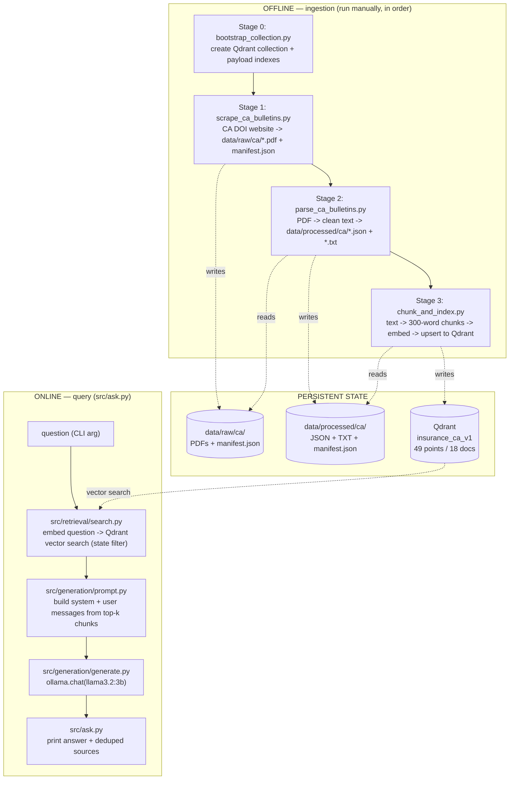
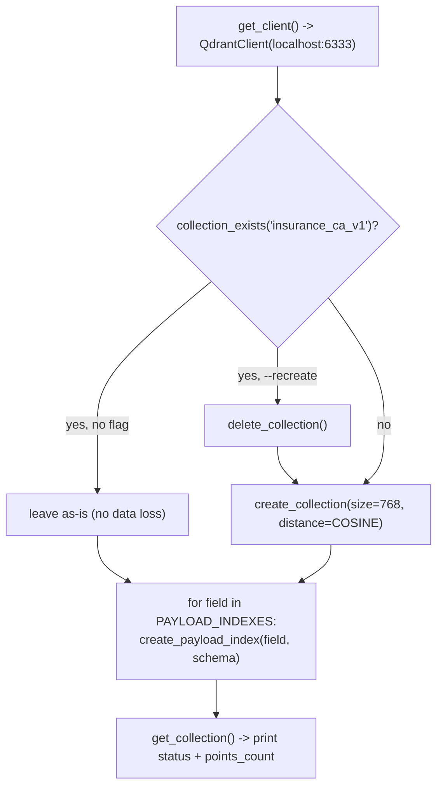
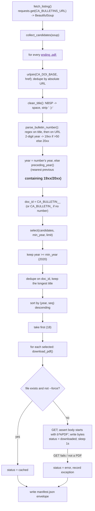
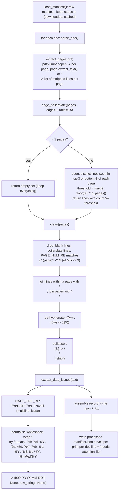
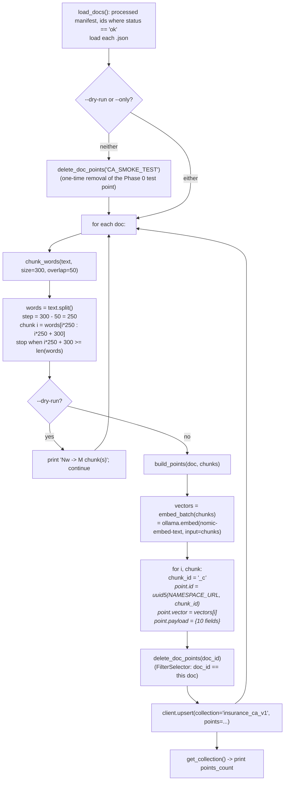
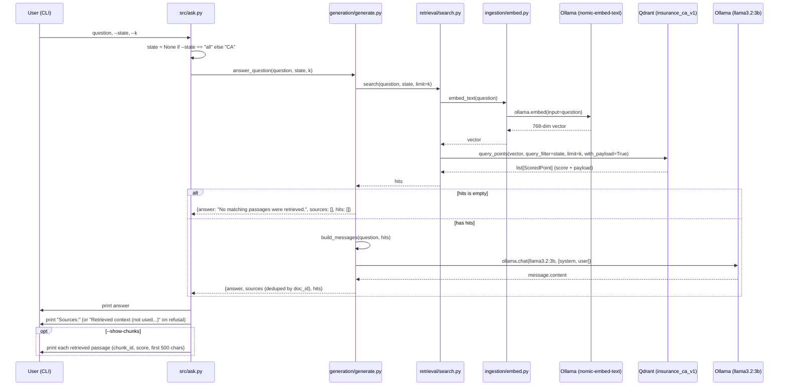

# Current Pipeline — State Insurance Regulations Knowledge Assistant

**Status:** end of Phase 1 (naive RAG, California only). No hybrid search, no
reranker, no API, no UI, no score-threshold guardrail yet — those are Phases 2–5.

This document describes **exactly what the code does today**, module by module.
It is a snapshot; when a phase changes the flow, update this file.

---

## 1. The two pipelines

The system has an **offline ingestion pipeline** (run by hand, populates the
vector store) and an **online query pipeline** (runs per question).



---

## 2. Configuration reference (`config/settings.py`)

Every module imports its constants from here. Env vars of the same name override.

| Constant | Value | Used by |
|---|---|---|
| `PROJECT_ROOT` | repo root (`Path(__file__).parents[1]`) | all path constants |
| `DATA_DIR` | `<root>/data` | — |
| `RAW_CA_DIR` | `<root>/data/raw/ca` | scrape (write), parse (read) |
| `PROCESSED_CA_DIR` | `<root>/data/processed/ca` | parse (write), chunk (read) |
| `EVAL_DIR` | `<root>/data/eval` | Phase 2 (unused now) |
| `CA_DOI_BASE` | `https://www.insurance.ca.gov` | scrape (URL resolution) |
| `CA_BULLETINS_URL` | `.../bulletin-notices-commiss-opinion/bulletins.cfm` | scrape (listing), parse/chunk (manifest provenance) |
| `HTTP_HEADERS` | `{"User-Agent": "insurance-rag-bot/0.1 (educational RAG project)"}` | scrape |
| `REQUEST_DELAY_SEC` | `1.0` | scrape (delay between downloads) |
| `CHUNK_SIZE_WORDS` | `300` | chunk |
| `CHUNK_OVERLAP_WORDS` | `50` | chunk |
| `QDRANT_HOST` / `QDRANT_PORT` | `localhost` / `6333` | bootstrap, chunk, search |
| `CA_COLLECTION` | `insurance_ca_v1` | bootstrap, chunk, search |
| `CA_COLLECTION_ALIAS` | `insurance_ca_live` | Phase 5 (unused now) |
| `EMBED_MODEL` | `nomic-embed-text` (Ollama) | embed |
| `EMBED_DIM` | `768` | bootstrap (vector size) |
| `LLM_MODEL` | `llama3.2:3b` (Ollama) — small on purpose: CPU-only inference, see below | generate |
| `LLM_NUM_PREDICT` | `300` (max generated tokens) | generate |
| `OLLAMA_KEEP_ALIVE` | `30m` (models stay resident between calls) | embed, generate |
| `RETRIEVE_K` | `3` (chunks sent to the LLM) | generate, `ask.py` |
| `PAYLOAD_INDEXES` | `{state: keyword, document_type: keyword, date_effective: datetime}` | bootstrap |

External services assumed running: **Qdrant** (`docker compose up -d`, port 6333)
and **Ollama** (native, serving `llama3.2:3b` + `nomic-embed-text`).

---

## 3. Stage 0 — Collection bootstrap

**File:** `src/ingestion/bootstrap_collection.py`
**Run:** `python -m src.ingestion.bootstrap_collection [--recreate]`
**Frequency:** once (or after a schema change). Idempotent.



**What it guarantees:**
- Collection `insurance_ca_v1` exists with **768-dim cosine** vectors
  (matches `nomic-embed-text` output).
- Payload indexes exist so metadata filters don't full-scan:
  - `state` → `keyword`
  - `document_type` → `keyword`
  - `date_effective` → `datetime`
- Re-creating an index with the same schema is a no-op → the whole script is
  safe to re-run.
- `--recreate` is the only destructive path and must be passed explicitly.

**Why not `recreate_collection`:** that call (used in the old `test_pipeline.py`)
silently drops all data on every run. Deprecated in qdrant-client 1.18 anyway.

---

## 4. Stage 1 — Scrape

**File:** `src/ingestion/scrape_ca_bulletins.py`
**Run:** `python -m src.ingestion.scrape_ca_bulletins [--limit 18] [--min-year 2020] [--list-only] [--force]`
**Output:** `data/raw/ca/<doc_id>.pdf` (18 files) + `data/raw/ca/manifest.json`

### Flow



### Key behaviours

- **PDF-only.** CA DOI bulletins from 2018+ are PDFs (older ones are `.cfm`
  HTML). We deliberately take the PDF path — see Roadmap "Phase 1 source
  decision".
- **Deduping is two-level:** first by absolute URL (the listing page has
  multiple anchors pointing at the same file), then by `doc_id` in `select()`.
- **Year attribution** prefers the bulletin number (`2025-7` → 2025); falls
  back to the nearest `<h3>` heading above the link in document order.
- **Politeness:** custom `User-Agent`, `REQUEST_DELAY_SEC` (1s) sleep between
  actual downloads (not between cache hits), 30s/60s timeouts.
- **Validation:** the response body must start with the `%PDF` magic bytes,
  otherwise it is recorded as an error and skipped.

### `data/raw/ca/manifest.json` schema (envelope)

```json
{
  "source": "ca_doi_bulletins",
  "listing_url": "https://www.insurance.ca.gov/.../bulletins.cfm",
  "scraped_at": "2026-09-05T...Z",
  "document_count": 18,
  "documents": [
    {
      "doc_id": "CA_BULLETIN_2025_7",
      "bulletin_number": "2025-7",
      "title": "Bulletin 2025-7: Insurance Coverage for Smoke Damage ...",
      "year": 2025,
      "document_type": "bulletin",
      "source_url": "https://www.insurance.ca.gov/.../Bulletin-2025-7-....pdf",
      "local_path": "data/raw/ca/CA_BULLETIN_2025_7.pdf",
      "status": "downloaded",          // or "cached", or "error"
      "bytes": 266075,
      "scraped_at": "2026-09-05T...Z"
      // on error: "status": "error", "error": "<message>"
    }
  ]
}
```

The envelope wrapper (`source` / `listing_url` / `scraped_at` around
`documents[]`) exists so a future multi-source catalog can merge manifests with
provenance intact.

---

## 5. Stage 2 — Parse

**File:** `src/ingestion/parse_ca_bulletins.py`
**Run:** `python -m src.ingestion.parse_ca_bulletins [--only <doc_id>]`
**Input:** raw `manifest.json` (rows with `status` in `downloaded` / `cached`)
**Output:** `data/processed/ca/<doc_id>.json` (canonical), `<doc_id>.txt`
(text only, for humans), `data/processed/ca/manifest.json`

### Flow



### Cleaning rationale

| Step | Removes / fixes | Note |
|---|---|---|
| `edge_boilerplate` | repeated letterhead, address block, "PROTECT • PREVENT • PRESERVE" footer | frequency-based: a line must appear near the edge of ≥50% of pages; disabled for <3-page docs so short bulletins keep everything |
| `PAGE_NUM_RE` | "Page 1 of 3", bare "- 2 -", "3" | applied per line regardless of page count |
| de-hyphenation | "prin-\nciple" → "principle" | side effect: genuine wrapped compounds ("cost-\nsharing") also merge; acceptable for Phase 1 |
| newline collapse | 3+ blank lines → paragraph break | |

**Kept on purpose:** the page-1 header block (`RICARDO LARA / CALIFORNIA
INSURANCE COMMISSIONER / BULLETIN 2025-14 / TO: / FROM: / DATE: / RE:`) — it is
signal, and it only appears once so the frequency filter leaves it.

### Known extraction artifacts

- **Footnote superscripts inline as digits** — `All Health Insurers1`,
  `federal bodies2`. Cosmetic; not fixed in Phase 1.
- **Scanned PDFs** would yield `< MIN_USEFUL_CHARS` (200) → `status =
  "empty_or_scanned"` and a `<-- CHECK` flag. None hit this in the current set.

### `data/processed/ca/<doc_id>.json` schema

```json
{
  "doc_id": "CA_BULLETIN_2025_14",
  "state": "CA",
  "document_type": "bulletin",
  "bulletin_number": "2025-14",
  "title": "Bulletin 2025-14: Chaptered Assembly Bill 144 ...",
  "year": 2025,
  "source_url": "https://www.insurance.ca.gov/.../CDI-Bulletin-2025-14-....pdf",
  "date_issued": "2025-09-30",
  "date_issued_raw": "September 30, 2025",
  "date_effective": null,
  "n_pages": 5,
  "n_chars": 11448,
  "status": "ok",
  "text": "RICARDO LARA\nCALIFORNIA INSURANCE COMMISSIONER\n...",
  "parsed_at": "2026-09-05T...Z"
}
```

`date_effective` is **null for every doc** — it is stated in prose ("effective
immediately", "on January 1, 2026", or not at all) and needs body parsing or an
LLM pass. Deferred to Phase 2 / manual. The `date_effective` payload index
exists and works; it is simply empty.

### Processed `manifest.json`

```json
{
  "source": "ca_doi_bulletins",
  "listing_url": "https://www.insurance.ca.gov/.../bulletins.cfm",
  "parsed_at": "2026-09-05T...Z",
  "document_count": 18,
  "documents": [
    { "doc_id": "CA_BULLETIN_2025_14", "n_pages": 5, "n_chars": 11448,
      "status": "ok", "date_issued": "2025-09-30" }
  ]
}
```

---

## 6. Stage 3 — Chunk & index

**File:** `src/ingestion/chunk_and_index.py`
**Run:** `python -m src.ingestion.chunk_and_index [--only <doc_id>] [--dry-run]`
**Input:** processed `manifest.json` (rows with `status == "ok"`) + each
`<doc_id>.json`
**Output:** points upserted into Qdrant `insurance_ca_v1`

### Flow



### Chunking math (300 / 50)

- Text is split on **whitespace** (`str.split()`), so "words" are whitespace
  tokens, not linguistic words. No sentence or header awareness — this is the
  naive baseline.
- Window size 300, step `300 − 50 = 250`. Chunk *i* spans word indices
  `[250·i, 250·i + 300)`; the last 50 words of chunk *i* are the first 50 of
  chunk *i+1* (the overlap). Loop stops once a window reaches the end.
- Consequence for this corpus (bulletins ≈ 230–1,900 words): most docs → **1
  chunk**; the 5-page 2025-14 → several. Current total: **49 points from 18
  docs**.

### Idempotency & re-runs

- `point.id = uuid5(chunk_id)` is deterministic, so re-upserting the same chunk
  overwrites rather than duplicates.
- Before writing a doc's chunks, **all existing points for that `doc_id` are
  deleted** (payload filter). This means changing `CHUNK_SIZE_WORDS` and
  re-running leaves no orphan points from the old chunking.
- `CA_SMOKE_TEST` (the Phase 0 smoke-test point) is deleted on a full run.

### Point payload schema (what lives in Qdrant)

```json
{
  "doc_id": "CA_BULLETIN_2025_7",
  "state": "CA",
  "document_type": "bulletin",
  "title": "Bulletin 2025-7: Insurance Coverage for Smoke Damage ...",
  "date_issued": "2025-02-25",
  "date_effective": null,
  "source_url": "https://www.insurance.ca.gov/.../Bulletin-2025-7-....pdf",
  "parent_headers": [],
  "chunk_id": "CA_BULLETIN_2025_7_c0",
  "content": "<the 300-word slice of cleaned text>"
}
```

`parent_headers` is always `[]` in Phase 1 (populated only when header-aware
chunking lands in Phase 2).

### Qdrant collection state

| Property | Value |
|---|---|
| Name | `insurance_ca_v1` |
| Vector | size 768, distance Cosine |
| Payload indexes | `state` (keyword), `document_type` (keyword), `date_effective` (datetime) |
| Points | 49 (from 18 docs) |
| `indexed_vectors_count` | 0 — below Qdrant's `indexing_threshold` (10000), so search is **exact** brute force, not HNSW. This is expected and fine at this scale. |

---

## 7. Online — Query pipeline

**Entry point:** `src/ask.py`
**Run:** `python -m src.ask "<question>" [--state CA|all] [--k 5] [--show-chunks]`

### Sequence



### 7.1 Retrieval — `src/retrieval/search.py`

```python
search(query, state="CA", limit=3):   # generate.py passes RETRIEVE_K = 3
    client  = QdrantClient(localhost:6333)          # new client per call
    vector  = embed_text(query)                     # Ollama nomic-embed-text, 768-dim
    filter  = None if state is None else
              Filter(must=[FieldCondition(key="state", match=MatchValue(state))])
    return client.query_points(
        collection_name = "insurance_ca_v1",
        query           = vector,
        query_filter    = filter,                   # metadata PRE-filter
        limit           = limit,
        with_payload    = True,
    ).points                                        # list[ScoredPoint]
```

- **Single dense vector search.** No BM25, no fusion, no rerank. Cosine
  similarity over 49 vectors.
- **`state` is a pre-filter** — Qdrant restricts the candidate set to
  `state == "CA"` *before* scoring (uses the `state` keyword payload index).
  `--state all` passes `None` and searches everything (still only CA data
  exists).
- Score in the output is cosine similarity in `[-1, 1]`; observed values for
  real questions sit around `0.6–0.75`.

### 7.2 Prompt construction — `src/generation/prompt.py`

`build_messages(question, hits)` returns:

```
[ {role: system, content: SYSTEM_PROMPT},
  {role: user,   content: "Context passages:\n\n" + format_context(hits)
                          + "\n\nQuestion: " + question} ]
```

`format_context` renders each hit as:

```
[1] Bulletin 2025-7 - Bulletin 2025-7: Insurance Coverage for Smoke Damage ...
Source: https://www.insurance.ca.gov/.../Bulletin-2025-7-....pdf
<chunk content>

[2] Bulletin 2025-9 - ...
...
```

`SYSTEM_PROMPT` (current, softened version) instructs the model to:
- base every claim on the passages, no outside knowledge, no guessed
  figures/dates/code sections;
- **combine / compare / summarise across passages is explicitly allowed**;
- reply **exactly** `"The provided bulletins do not cover this."` *only* if the
  passages do not address the topic at all;
- cite bulletin numbers, e.g. `(Bulletin 2025-8)`;
- be concise, quote regulatory language when it matters.

> The earlier, stricter prompt ("if the context does not contain the answer,
> refuse") caused the dev LLM (then `llama3.1:8b`) to refuse a valid
> *comparison* question because no single passage stated the comparison
> verbatim. This is a known weakness of **prompt-based refusal** and the reason
> Phase 3 moves refusal to a retrieval-score threshold. See
> `Challenges and Learnings.md` #1.

### 7.3 Generation — `src/generation/generate.py`

```python
answer_question(question, state="CA", k=RETRIEVE_K):   # RETRIEVE_K = 3
    hits = search(question, state, k)
    if not hits:
        return {"answer": "No matching passages were retrieved.", "sources": [], "hits": []}
    messages = build_messages(question, hits)
    resp = ollama.chat(
        model="llama3.2:3b", messages=messages,
        keep_alive=OLLAMA_KEEP_ALIVE,                 # "30m" - skip model reload
        options={"num_predict": LLM_NUM_PREDICT},     # 300 - cap output length
    )
    return {
        "answer":  resp["message"]["content"].strip(),
        "sources": _sources(hits),     # one row per doc_id, best score wins, sorted desc
        "hits":    hits,
    }
```

`_sources(hits)` collapses chunk-level hits to **document-level** citations:
`{doc_id, bulletin_number, title, source_url, date_issued, score}`, deduped by
`doc_id` keeping the max score, sorted by score descending.

### 7.4 Presentation — `src/ask.py`

- Prints the answer.
- Prints `Sources:` followed by numbered rows
  (`[i] Bulletin <num> (<date_issued>) score=<x.xxx>`, title, URL).
  If the answer begins with the refusal sentence, the header instead reads
  `Retrieved context (not used - answer was a refusal):` — because the source
  list is the *retrieved* chunks, not necessarily what the model used.
- `--show-chunks` additionally dumps each retrieved passage
  (`chunk_id`, score, first 500 chars, newlines flattened).

---

## 8. Data & state artifacts

| Artifact | Produced by | Consumed by | Shape |
|---|---|---|---|
| `data/raw/ca/<doc_id>.pdf` | Stage 1 | Stage 2 | binary PDF |
| `data/raw/ca/manifest.json` | Stage 1 | Stage 2 | envelope + `documents[]` (18) |
| `data/processed/ca/<doc_id>.json` | Stage 2 | Stage 3 | metadata + full `text` |
| `data/processed/ca/<doc_id>.txt` | Stage 2 | humans | cleaned text only |
| `data/processed/ca/manifest.json` | Stage 2 | Stage 3 | envelope + `documents[]` (18) |
| Qdrant `insurance_ca_v1` | Stage 3 | `search.py` | 49 points, 768-dim + 10-field payload |
| `data/eval/` | — | Phase 2 | empty |

Nothing in the query pipeline writes state. No cache, no logs, no request IDs
(those arrive in Phase 3).

---

## 9. What is deliberately NOT here yet

| Missing piece | Arrives in |
|---|---|
| Evaluation set + Hit@K / Recall@K / MRR measurement | Phase 2 |
| Header-aware chunking (`parent_headers` populated) | Phase 2 |
| BM25 sparse search + Reciprocal Rank Fusion | Phase 2 |
| Cross-encoder reranking (`bge-reranker-base`) | Phase 2 |
| Chunk size / overlap sweep | Phase 2 |
| FastAPI service, Pydantic schema, correlation IDs, exact cache | Phase 3 |
| **Score-threshold refusal guardrail** (replaces prompt-based refusal) | Phase 3 |
| OpenAI provider swap | Phase 3 / 5 |
| Streamlit UI, citations, feedback → SQLite | Phase 4 |
| LLM-as-judge (Faithfulness / Answer Relevance), Blue/Green alias swap | Phase 5 |
| `date_effective` population | Phase 2 / manual |
| Second state (NY or TX), cross-state filtering | Phase 6 |

---

## 10. Known issues surfaced during Phase 1

1. **Prompt-based refusal is unreliable.** A small model conflates "not stated
   verbatim" with "topic not covered" and over-refuses synthesis/comparison
   questions. Fix = Phase 3 score-threshold guardrail; interim = softened
   `SYSTEM_PROMPT`.
2. **Near-duplicate documents.** 6 moratorium bulletins and 4 principle-based
   reserving bulletins share boilerplate (≈50–65% text similarity). Good
   retrieval stress test; the Phase 2 eval set must include questions that force
   disambiguation (e.g. Life vs Long-Term Care assessment).
3. **Footnote superscripts inline as digits** in parsed text.
4. **`date_effective` entirely null** — not extracted yet.
5. **New `QdrantClient` per `search()` call** — fine at this scale, worth a
   shared client when the API lands.
6. **CPU-only LLM inference.** No Ollama-usable GPU (Intel Arc iGPU
   unsupported), so answers take tens of seconds. Mitigated with a small dev
   model (`llama3.2:3b`), `keep_alive=30m`, `num_predict=300`, and `k=3`. See
   `Challenges and Learnings.md` #2. Real fix = OpenAI provider in Phase 3.
